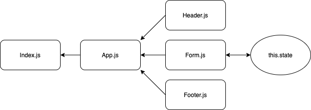

# RESTy
## Aysia Brown

- Practice using React, and transferring user input to the state. 

### Start Up
- `cd` into the `resty` directory 
- make sure to run `npm i` for the dependencies 
- run `npm start` 

### UML
